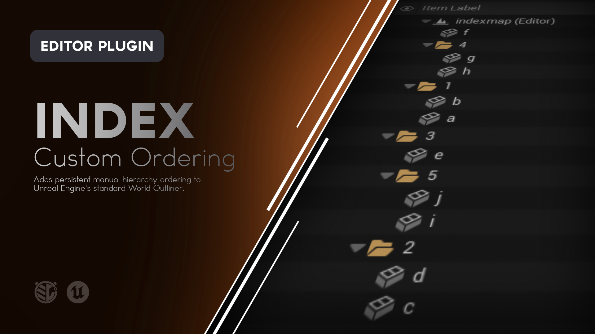
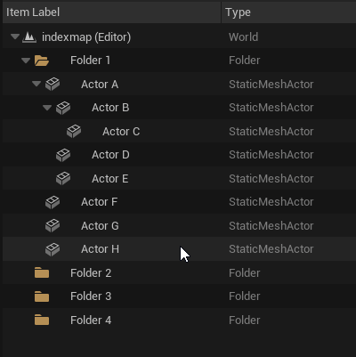
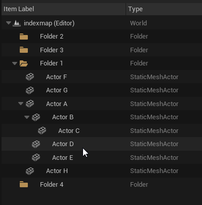
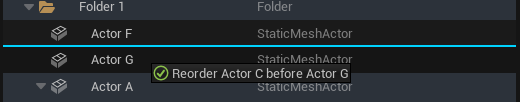
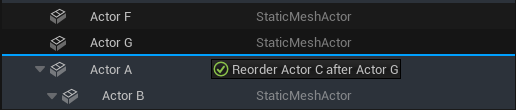
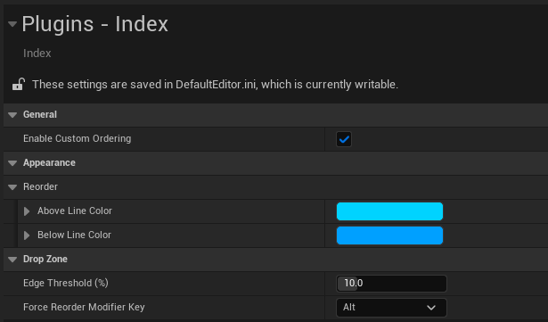

# Index

**Persistent manual hierarchy ordering for Unreal Engine's World Outliner.**

Index lets you manually arrange Actors and Folders in the World Outliner and keeps them where you put them.

Actors and Folders can share the same ordered hierarchy, names can change without changing position, multi-selections move as a block, and your custom ordering persists when the level is saved.

  



---

## What is Index?

The World Outliner is a hierarchy, but organizing that hierarchy is normally tied heavily to names.

That often leads to naming conventions designed partly around **where something should appear** rather than simply **what something is**.

Index separates those concepts.

Actors and Folders can be manually reordered inside their hierarchy while keeping their actual names intact.

You can arrange:

```
PlayerStart
Gameplay
DirectionalLight
Environment
Audio
PostProcessVolume
```

because that order makes sense for your project, regardless of how those items would normally sort by label.

Index also understands hierarchy operations.

Folders can be placed between Actors. Parent Actors carry their children. Multi-selections move as ordered blocks. Renaming does not destroy the custom order.

Once the level is saved, that organization stays with it.

---

# Features

### Manual World Outliner Ordering

Drag Actors and Folders above or below other rows to explicitly control their position.

### Mixed Actor and Folder Ordering

Actors and Folders can occupy the same ordered sibling list wherever Unreal's hierarchy allows them to exist together.

For example:

```
PlayerStart
Environment
DirectionalLight
Gameplay
PostProcessVolume
```

### Persistent Ordering

Manual hierarchy order survives:

- Level saves
    
- Editor restarts
    
- Level switching
    
- Renaming
    
- Filtering
    
- Multiple World Outliner windows
    

### Rename Without Reordering

Rename an Actor or Folder without losing its manually assigned position.

### Multi-Selection Reordering

Move several selected rows together as one ordered block.

Their existing visual order is preserved.

### Hierarchy-Aware Movement

Parent Actors and Folders carry their contained hierarchy without flattening their descendants.

### Before and After Placement

Drop near the top or bottom edge of a row to place the selected item immediately before or after it.

### Force Reorder Modifier

Hold **Alt** by default to turn the entire target row into two large reorder zones.

- Top half places before
    
- Bottom half places after
    

The modifier can be changed or disabled.

### Clear Drag Feedback

Index displays:

- Full-width insertion lines
    
- Different colors for Above and Below placement
    
- Contextual drag text describing what will happen when released
    

### New Item Placement

New Actors and Folders are inserted at the top of their local hierarchy tier.

### Duplicate Placement

Duplicated Actors, Folders, and hierarchy blocks are placed immediately after their source when Index can clearly determine the relationship.

### Release from Parent

Drop a child onto its current parent to move it out of that relationship.

### Undo / Redo

Index ordering and supported hierarchy operations participate in Unreal Engine's Undo and Redo workflow.

### Configurable Behavior

Customize:

- Above insertion color
    
- Below insertion color
    
- Edge drop-zone size
    
- Force reorder modifier
    
- Whether custom ordering is enabled
    

### Editor Only

Index adds no runtime Actors, Components, assets, or gameplay systems.

---



---

# Using Index

Once Index is enabled, manual ordering is integrated directly into the standard World Outliner.

There is no separate Index window.

Drag a compatible Actor or Folder row to begin.

Index divides the target row into three regions:

|Drop Position|Result|
|---|---|
|**Top Edge**|Insert immediately before the target.|
|**Center**|Perform the hierarchy action described by the drag tooltip.|
|**Bottom Edge**|Insert immediately after the target.|

When Index is performing a reorder, a full-width insertion line marks the exact destination.

If no insertion line is visible, the center hierarchy action remains in control.

---

# Reordering Actors and Folders

To manually reorder something:

1. Click and drag an Actor or Folder.
    
2. Move the cursor near the top or bottom edge of the destination row.
    
3. Wait for the Index insertion line.
    
4. Release.
    

Dragging near the:

**Top edge**

places the selection immediately before the target.

**Bottom edge**

places the selection immediately after the target.

The hierarchy itself does not need to change.

---

## Example

Starting hierarchy:

```
DirectionalLight
Environment
Gameplay
PlayerStart
PostProcessVolume
```

Drag `PlayerStart` above `Environment`:

```
DirectionalLight
PlayerStart
Environment
Gameplay
PostProcessVolume
```

Rename it later:

```
BP_PlayerSpawn
```

Its position remains:

```
DirectionalLight
BP_PlayerSpawn
Environment
Gameplay
PostProcessVolume
```

The label changed.

The Index position did not.

---

# Force Reorder

Small edge targets are useful because they leave the center of the row available for normal hierarchy operations.

Sometimes you know you only want to reorder.

Hold:

**Alt**

while dragging.

The complete row becomes two large reorder regions:

```
┌──────────────────────────┐
│      INSERT BEFORE       │
├──────────────────────────┤
│       INSERT AFTER       │
└──────────────────────────┘
```

The:

- Top half inserts before
    
- Bottom half inserts after
    

This makes precise ordering much easier when hierarchy parenting is not what you want.

The modifier can be changed under:

**Project Settings > Plugins > Index**

Available options are:

- Alt
    
- Shift
    
- Ctrl
    
- None / Disabled
    



---

# Actors and Folders Share the Same Order

Index treats Actors and Folders as equal members of a sibling hierarchy wherever Unreal allows them to share one.

You can arrange:

```
Actor A
Folder X
Actor B
Folder Y
Actor C
```

without renaming anything to force that presentation.

Each hierarchy tier has its own manual order.

For example:

```
ROOT
├── PlayerStart
├── Environment
│   ├── Ground
│   ├── Architecture
│   └── Props
├── DirectionalLight
├── Gameplay
│   ├── Trigger_A
│   └── Trigger_B
└── PostProcessVolume
```

The root has one order.

`Environment` has another.

`Gameplay` has another.

Changing one does not rebuild the others.

---

# Working with Multiple Actors

Index supports multi-selection reordering.

When multiple rows are moved:

1. Index determines the highest selected hierarchy roots.
    
2. Descendants already carried by a selected parent are not processed again.
    
3. The remaining selected roots preserve their existing visual order.
    
4. They move together as one contiguous block.
    

For example:

```
A   selected
B
C   selected
D
E   selected
```

Drop the selection after `D`:

```
B
D
A
C
E
```

The selected rows remain ordered:

```
A
C
E
```

rather than being rearranged during the move.

---

# Moving Hierarchies

Index preserves Unreal Engine's hierarchy semantics.

Moving a Folder carries its complete subtree.

Moving a parent Actor carries its attached descendants.

For example:

```
Environment
├── Building
│   ├── Door
│   └── Window
└── Ground
```

Moving `Building` does not flatten the hierarchy into:

```
Building
Door
Window
```

The existing relationship remains:

```
Building
├── Door
└── Window
```

Index changes where that hierarchy block appears, not what its internal structure means.

---

# Parenting and Moving Into Folders

The center of a row remains available for hierarchy operations.

When dropping onto an Actor or Folder, the drag tooltip describes what the operation will do.

Examples include:

```
Parent Lamp to Table
```

```
Move 2 items into Environment
```

```
Detach from Parent_A and place after it
```

```
Move folder out of Environment and place after it
```

If you want a pure before/after reorder instead, use the row edge or the Force Reorder modifier.

---

# Releasing from a Parent

Dropping a child directly onto its current parent means:

**Release this child from the current relationship.**

For an attached Actor:

```
Parent
└── Child
```

Dropping `Child` onto `Parent` detaches it and places it immediately after the former parent:

```
Parent
Child
```

The same concept applies to Folder relationships.

For example:

```
Environment
└── Props
```

Dropping `Props` onto `Environment` moves it out one Folder level and places it after `Environment`.

This provides a quick way to move something one level upward without manually finding another destination.

---

# New Actors and Folders

Newly created Actors and Folders are placed at the **top of their local hierarchy tier**.

Existing sibling order remains unchanged.

For example:

```
Environment
Gameplay
Lighting
```

Create a new Folder:

```
NewFolder
Environment
Gameplay
Lighting
```

You can then drag it wherever you want.

---

# Duplicating

When Index can clearly determine the source relationship, duplicated Actors, Folders, or hierarchy blocks are placed immediately after their source.

For example:

```
Prop_A
Prop_B
Prop_C
```

Duplicate `Prop_B`:

```
Prop_A
Prop_B
Prop_B_Copy
Prop_C
```

Nested relationships inside a duplicated hierarchy are preserved rather than flattened.

If the source relationship is ambiguous across multiple hierarchy tiers, the duplicated items use the normal new-item placement rule in their resulting tier.

---

# Dropping Into Empty Space

Dragging Actors or Folders into blank space below the World Outliner rows moves the selected highest-level roots to the level's root hierarchy.

The moved block is placed at the bottom.

Nested descendants stay attached to their moved parent.

---

# Deleting

Deleting an Actor or Folder removes that row from the saved Index hierarchy.

The remaining siblings retain their relative order.

For example:

```
A
B
C
D
```

Delete `B`:

```
A
C
D
```

Index does not need to rebuild the hierarchy alphabetically.

---

# Search and Filtering

World Outliner search filters change what is visible.

They do not change the saved Index hierarchy.

If some rows are hidden by a search filter, Index still reorders against the complete underlying sibling sequence.

This means filtering the Outliner does not silently destroy or rebuild your manual organization.

---

# Sorting by Another Column

Index maintains a saved manual sequence for the World Outliner.

If you temporarily sort the Outliner using another visible column, Unreal may display a different presentation order.

Performing an Index reorder returns the hierarchy to its saved manual ordering.

---

# Drag Feedback

Index provides visual feedback specifically for manual ordering.

### Before Placement

A full-width insertion line shows that the moved block will be inserted before the target.

### After Placement

A different full-width insertion line shows that the moved block will be inserted after the target.

### Hierarchy Actions

When the operation is parenting, moving into a Folder, or detaching rather than reordering, the drag tooltip describes the resulting operation.

| Insert Before                                                       | Insert After                                                       |
| ------------------------------------------------------------------- | ------------------------------------------------------------------ |
|  |  |

---

# Project Settings

Open:

**Project Settings > Plugins > Index**

to configure Index.

|Setting|Purpose|
|---|---|
|**Enable Custom Ordering**|Enables or disables Index's custom drag-and-drop ordering behavior.|
|**Above Line Color**|Color used for the Insert Before indicator.|
|**Below Line Color**|Color used for the Insert After indicator.|
|**Edge Threshold (%)**|Controls how much of the top and bottom of each row acts as a reorder zone.|
|**Force Reorder Modifier Key**|Chooses the modifier used to turn the entire row into Before and After reorder zones.|

---

## Default Settings

Index ships with:

|Setting|Default|
|---|---|
|**Custom Ordering**|Enabled|
|**Edge Threshold**|10%|
|**Force Reorder Modifier**|Alt|
|**Above Line Color**|Light blue|
|**Below Line Color**|Deeper blue|

You can adjust these values to better match your preferred Outliner workflow.



---

# Example Workflow

Imagine a gameplay level containing:

```
BP_Checkpoint
DirectionalLight
BP_PlayerStart
Environment
PostProcessVolume
Audio
Gameplay
```

Alphabetical or label-based ordering is not especially useful here.

You might instead organize the root as:

```
BP_PlayerStart
Gameplay
Environment
DirectionalLight
PostProcessVolume
Audio
BP_Checkpoint
```

Then organize the contents of `Gameplay` independently:

```
Gameplay
├── SpawnPoints
├── Encounters
├── BP_Checkpoint
├── Objectives
└── Debug
```

Nothing needs to be renamed just to influence where it appears.

The labels describe **what the objects are**.

Index describes **where you want them organized**.

---

# Saving Index Ordering

Index does not create a separate asset or sidecar file.

Each level stores its Index hierarchy information directly in the level package metadata.

After changing the hierarchy order, save the affected level using your normal Unreal Engine workflow:

**File > Save**

or:

**File > Save All**

The saved hierarchy survives:

- Closing and reopening the editor
    
- Switching levels
    
- Renaming Actors
    
- Renaming Folders
    
- Outliner filtering
    

An Index ordering change marks the level package as modified because the hierarchy snapshot belongs to that level.

---

# Installation

Index can be installed through **Fab**, from a **precompiled GitHub Release**, or directly from the **GitHub source**.

For most users, the Fab or GitHub Release installation is recommended.

---

## Fab / Epic Games Launcher

> **Availability:** Use this installation method once Index is available through Fab.

1. Add **Index** to your library on Fab.
    
2. Open the **Epic Games Launcher**.
    
3. Navigate to your Unreal Engine Library.
    
4. Locate Index in your Fab / Vault library.
    
5. Install Index to the supported Unreal Engine version.
    
6. Launch your Unreal Engine project.
    
7. Open **Edit > Plugins**.
    
8. Search for **Index**.
    
9. Enable the plugin if it is not already enabled.
    
10. Restart Unreal Editor if prompted.
    

Once enabled, Index integrates directly into the World Outliner.

---

## GitHub Release

> [!NOTE]  
> Precompiled GitHub packages will appear on the repository's **Releases** page when available.

### 1. Download Index

Open the repository's Releases page:

[https://github.com/mippi-the-dork/Index/releases](https://github.com/mippi-the-dork/Index/releases)

Download the packaged plugin matching your Unreal Engine version and platform.

For example:

```
Index-v1.0.0-UE5.8.2-Win64.zip
```

Do not use GitHub's automatically generated **Source code** ZIP as a precompiled plugin package.

### 2. Close Unreal Editor

Close the project before installing the plugin.

### 3. Locate Your Project Plugins Folder

Your project should contain a `Plugins` directory beside the `.uproject` file:

```
YourProject/
├── Config/
├── Content/
├── Plugins/
└── YourProject.uproject
```

If the `Plugins` directory does not exist, create it.

### 4. Extract Index

Extract the `Index` folder into:

```
YourProject/Plugins/
```

The final structure should look similar to:

```
YourProject/
├── Plugins/
│   └── Index/
│       ├── Config/
│       ├── Doc/
│       ├── Resources/
│       ├── Source/
│       └── Index.uplugin
└── YourProject.uproject
```

### 5. Launch the Project

Open your Unreal Engine project.

If necessary, navigate to:

**Edit > Plugins**

Search for:

```
Index
```

Enable the plugin and restart Unreal Editor if prompted.

---

## GitHub Source

Developers who want the source or want to modify Index can clone the repository directly.

### Requirements

Building Index from source requires a working Unreal Engine C++ development environment.

For Windows this generally means:

- Unreal Engine 5.8.x
    
- Visual Studio with the appropriate C++ workloads
    
- A project capable of compiling C++ plugins
    

### Clone the Repository

Close Unreal Editor and navigate to your project's `Plugins` directory.

```
cd YourProject/Plugins
git clone https://github.com/mippi-the-dork/Index.git
```

Your project should now contain:

```
YourProject/Plugins/Index/
```

### Generate Project Files

If necessary:

1. Right-click your `.uproject`.
    
2. Select **Generate Visual Studio project files**.
    

Then open the generated solution and build your project's Editor target.

For example:

```
YourProjectEditor
Win64
Development Editor
```

Launch the project after compilation completes.

---

# Updating Index

## GitHub Release Installation

When updating a manually installed release:

1. Close Unreal Editor.
    
2. Remove the existing `Plugins/Index` folder.
    
3. Extract the new Index release into the `Plugins` directory.
    
4. Reopen the project.
    

Replacing the complete plugin folder is recommended rather than copying individual files over an older version.

Your saved hierarchy ordering lives with the level, not inside the plugin directory.

---

## Git Source Installation

If you cloned the repository using Git:

```
cd YourProject/Plugins/Index
git pull
```

Rebuild the project if the source has changed.

---

# Compatibility

The current Index version targets:

|||
|---|---|
|**Index Version**|1.0.0|
|**Unreal Engine**|5.8.2|
|**Platform**|Windows 64-bit|
|**Plugin Type**|Editor|
|**Runtime Dependency**|None|
|**Runtime Actors**|None|
|**Runtime Components**|None|
|**Packaged Game Impact**|None|

Index is currently configured as a Win64 editor plugin.

Compatibility with additional Unreal Engine versions or platforms should not be assumed unless explicitly listed in a release.

---

# How Index Works

Index does not replace Unreal Engine's Actor attachment or Folder hierarchy.

Unreal continues to determine:

- Which Actor is attached to which parent
    
- Which Actors belong to which Folders
    
- Which Folders contain other Folders
    

Index adds a saved **ordering layer** to those relationships.

Conceptually:

```
ROOT
├── Actor A
├── Folder X
├── Actor B
└── Folder Z
```

The root hierarchy owns an ordered list containing:

```
Actor A
Folder X
Actor B
Folder Z
```

`Folder X` then owns its own ordered child list.

Renaming an Actor or Folder does not rebuild these lists.

When the level is saved, Index serializes the hierarchy ordering into the level package metadata.

No additional Content Browser asset is required.

---

# Undo and Redo

Index integrates with Unreal Engine's transaction system.

Ordering and supported hierarchy operations can be undone and redone using the normal editor commands:

**Ctrl + Z**

and:

**Ctrl + Y**

Index restores the appropriate hierarchy ordering when the transaction is applied.

For some duplication workflows, Unreal's duplicate operation and Index's final placement may appear as separate Undo or Redo steps.

---

# What Index Does Not Do

Index is an **editor hierarchy organization tool**.

It does not:

- Rename Actors
    
- Rename Folders
    
- Create runtime hierarchy systems
    
- Add runtime Actors
    
- Add runtime Components
    
- Affect gameplay
    
- Create additional Content Browser assets
    
- Replace Unreal Engine's native attachment system
    
- Reorder items across different levels
    
- Reorder unloaded World Partition Actors
    
- Change Component ordering inside an Actor
    
- Automatically sort your hierarchy for you
    

Index gives you manual control over the order.

It does not decide what that order should be.

---

# Limitations

### Loaded Actors

Index operates on loaded World Outliner rows.

Unloaded World Partition Actors cannot be manually reordered until they are loaded and represented in the Outliner.

### Level Boundaries

Index does not perform custom reordering across different levels.

Hierarchy operations remain scoped to compatible level relationships.

### Actor Children

Attached Actor child tiers contain Actors only because Folders cannot exist beneath an attached Actor in Unreal's hierarchy.

### Components

Component rows and other unsupported Scene Outliner item types retain their normal Unreal Engine behavior.

Index primarily manages Actor and Folder hierarchy rows.

### Specialized Outliners

Index targets the standard Editor World Outliner.

PIE, Simulation, runtime gameplay, Blueprint Class Editors, and specialized custom Outliners are outside its editing scope.

### Duplication Undo

Some duplication workflows may use separate Undo or Redo steps for Unreal's duplication and Index's final hierarchy placement.

---

# Troubleshooting

## I Cannot Reorder an Actor or Folder

Check:

**Project Settings > Plugins > Index**

and make sure:

**Enable Custom Ordering**

is enabled.

Also confirm that the source and destination belong to compatible hierarchy and level contexts.

---

## I Keep Parenting Instead of Reordering

Move the cursor closer to the top or bottom edge of the target row.

An Index insertion line should appear.

Alternatively, hold the configured **Force Reorder Modifier**, which is **Alt** by default.

---

## My Custom Order Disappeared After Sorting Another Column

Sorting the World Outliner by another column can temporarily display a different order.

Perform an Index reorder to reactivate the saved manual sequence.

Your saved hierarchy has not necessarily been lost.

---

## My Order Did Not Persist After Restarting Unreal

Make sure the affected level was saved after making the ordering change.

Index stores its hierarchy snapshot with the level package.

Use:

**File > Save**

or:

**File > Save All**

before closing the editor.

---

## An Unloaded World Partition Actor Cannot Be Reordered

Load the Actor first.

Index can only reorder Actors currently represented by loaded World Outliner rows.

---

## A Duplicated Item Appeared at the Top Instead of Beside Its Source

Index places duplicates immediately after their source when it can resolve a clear local source relationship.

If the selection spans ambiguous hierarchy tiers, the duplicate may use the normal new-content rule for its resulting tier.

---

## A Search Filter Changed What I Can See

Outliner filters affect presentation, not the saved Index hierarchy.

Clear the filter to inspect the complete hierarchy.

---

# Reporting Bugs

If you encounter a problem, please open an issue:

[https://github.com/mippi-the-dork/Index/issues](https://github.com/mippi-the-dork/Index/issues)

When reporting a bug, include:

- Index version
    
- Unreal Engine version
    
- Windows version
    
- Whether Index was installed from Fab, a GitHub Release, or source
    
- The hierarchy before the operation
    
- What you dragged
    
- Where you dropped it
    
- What result you expected
    
- What actually happened
    
- Whether multiple selection was involved
    
- Whether World Partition was involved
    
- Steps to reproduce the problem
    
- Screenshots or video when relevant
    
- Any relevant Unreal Editor log output
    

For ordering bugs, a small text representation of the hierarchy before and after the operation can be especially useful.

---

# Feature Requests

Suggestions and feature requests are welcome through GitHub Issues.

When proposing a feature, describe the workflow problem you're trying to solve rather than only the implementation you would like to see.

That makes it easier to determine whether the feature belongs in Index and whether there may be a simpler solution.

---

# Contributions

Pull requests are welcome.

If you're considering a significant change, opening an Issue first is recommended so the intended behavior can be discussed before substantial work is done.

Index is intended to remain focused on manual World Outliner organization and hierarchy ordering.

---

# License

Index is distributed under the **MIT License**.

See `[LICENSE](https://chatgpt.com/c/LICENSE)` for details.

---

# About

Index is an Unreal Engine editor utility created by **Mippi the Dork**.

The plugin was built around a simple idea:

> Names should describe what something is, not where it has to appear in the World Outliner.

Index lets the hierarchy stay organized the way you want it, independent of what its Actors and Folders are called.